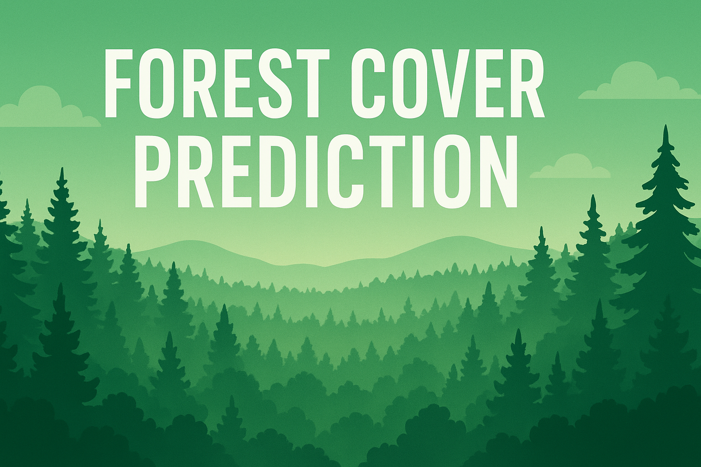
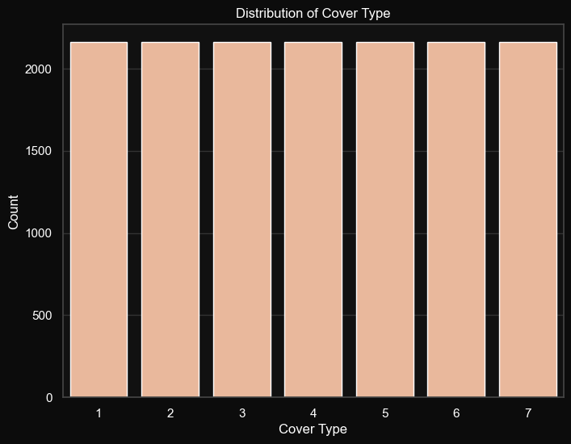
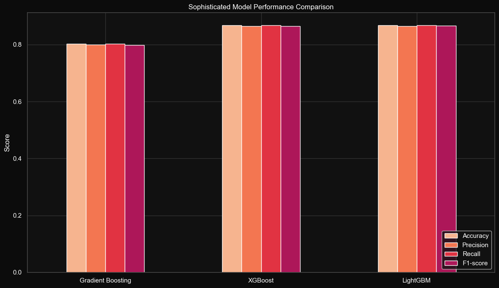
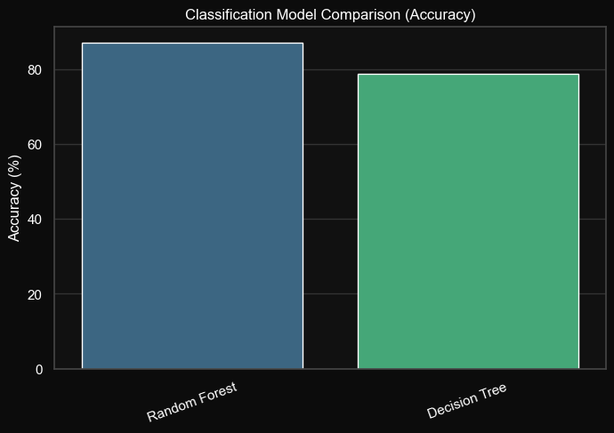
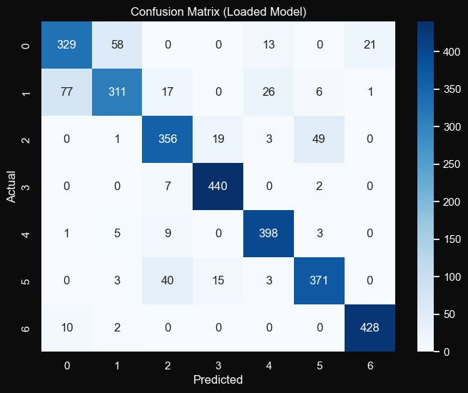

  
  Unified Mentors Private Limited

<!-- Image Logo -->

    

 

<!-- project and ML title -->
<h1 align='center' style="margin-bottom: 0px;">
<!-- <a href="https://git.io/typing-svg"> -->
  
</a></h1>

<!-- ML name -->
<h4 align='center' style="margin-top: 0; margin-bottom: 10px;">
<!-- <a href="https://git.io/typing-svg"> -->
  
</a></h4>

---
 
<!-- Table of content -->
## Table of Contant

* 
About this Project.

* 
Problem Statment.

* 
What DataSet cointains?

* 
Main library to be used.

* 
Visualizations/Chart.

* 
Conclusion.

* 
Acknowledgment.

 

---
<!-- About this Project -->
  
## About this Project:

    This project, completed under Unified Mentors Private Limited, focuses on predicting forest cover types using environmental and geographical data to support land management and conservation. Using a dataset of 15,120 records with 56 features such as Elevation, Slope, Aspect, and Hillshade, the study built and compared multiple machine learning models. After analysis and feature evaluation, Random Forest emerged as the best performer, accurately classifying seven forest types and highlighting key environmental predictors that influence forest distribution.
      

---
  
## Problem Statement:

- Can we accurately predict the type of forest cover in a given area solely based on its geographical and environmental characteristics? 
- Which specific environmental factors (like elevation, slope, or proximity to water and roads) are the most influential in determining the dominant forest type? 
- How can we leverage machine learning to build a robust model that distinguishes between seven distinct forest cover classes? 
- What are the implications of accurate forest cover prediction for sustainable land management, conservation efforts, and understanding ecological patterns? 
- Can a predictive model help in identifying areas vulnerable to changes in forest composition due to environmental shifts or human activity? 
  
---
  
<!-- What Data set Containes -->
<!-- columns and their descriptions -->

    

    What Data Set Contains?

 

1. Elevation - Elevation in meters.  
2. Aspect - Aspect in degrees azimuth.  
3. Slope - Slope in degrees.  
4. Horizontal_Distance_to_Hydrology - Horz Dist to nearest surface water features.  
5. Vertical_Distance_to_Hydrology: FroVert Dist to nearest surface water features.  
6. Horizontal_Distance_To_Roadways - Horz Dist to nearest roadway.  
7. Hillshade_9am (0 to 255 index) - Hillshade index at 9am, summer solstice.  
8. Hillshade_Noon (0 to 255 index) - Hillshade index at noon, summer solstice.  
9. Hillshade_3pm (0 to 255 index) - Hillshade index at 3pm, summer solstice.  
10. Horizontal_Distance_To_Fire_Points - Horz Dist to nearest wildfire ignition points.  
11. Wilderness_Area (4 binary columns, 0 = absence or 1 = presence) - Wilderness area designation.  
12. Soil_Type (40 binary columns, 0 = absence or 1 = presence) - Soil Type designation.  
13. Cover_Type - Forest Cover Type designation.  
=> Integer Classification of the forest cover types: 
|- 1 - Spruce/Fir.. 
|- 2 - Lodgepole Pine. 
|- 3 - Ponderosa Pine. 
|- 4 - Cottonwood/Willow.. 
|- 5 - Aspen. 
|- 6 - Douglas-fir. 
|- 7 - Krummholz. 

  

---
  
<!-- Library used in projects and their description -->

 
  
 Main Libraries Used 
 
    
  

  🔢 <b>NumPy</b> – For numerical computations and efficient array manipulation. 
  📊 <b>Pandas</b> – To load, clean, and analyze structured datasets. 
  📈 <b>Matplotlib & Seaborn</b> – For creating visualizations that explore data distributions, correlations, and feature relationships. 
  🧪 <b>SciPy</b> – Used for statistical analysis and hypothesis testing. 
  ⚙️ <b>scikit-learn (sklearn)</b> – Core machine learning framework used for:
  <ul> 
    <li>Data preprocessing (<code>StandardScaler</code>, <code>LabelEncoder</code>)</li> 
    <li>Model training and evaluation (<code>DecisionTreeClassifier</code>, <code>RandomForestClassifier</code>, <code>GradientBoostingClassifier</code>)</li> 
    <li>Performance metrics (<code>accuracy_score</code>, <code>precision_score</code>, <code>recall_score</code>, <code>f1_score</code>, <code>confusion_matrix</code>, <code>classification_report</code>)</li> 
    <li>Model validation (<code>train_test_split</code>, <code>cross_val_score</code>)</li>
  </ul>
  🚀 <b>XGBoost & LightGBM</b> – Advanced gradient boosting frameworks used for improving model accuracy and speed. 
  🚫 <b>Warnings</b> – To suppress unnecessary warning messages for cleaner notebook outputs. 
  
 

  

---
  

 Visualizations/Chart. 

    
    
    
    
    
    
    
    
    

---
  
## Conclusion:

The analysis of the forest cover prediction dataset revealed that the data was clean and well-structured, though slightly imbalanced across cover types. Exploratory analysis showed **Elevation** as the strongest predictor, with features like Slope, Aspect, Hillshade, and distances to hydrology and roads also influencing forest types. Correlation and visualization plots highlighted meaningful feature relationships. Several models were tested, and among them, **Random Forest** achieved the best accuracy, outperforming Decision Tree and performing competitively with Gradient Boosting, XGBoost, and LightGBM. The model was saved, reloaded, and validated successfully, proving reliable for prediction. Overall, the project identified key environmental factors affecting forest cover and demonstrated the effectiveness of machine learning—especially Random Forest—for ecological analysis and land management insights.

  

---
  
### Acknowledgments:

This project is dedicated to applying machine learning techniques to understand and predict forest cover types, contributing to sustainable land and resource management. Sincere thanks to Unified Mentors Private Limited for providing the opportunity and platform to carry out this work. Appreciation is also extended to the open-source community for developing the powerful tools and libraries that made this project possible.

 Created with 🧠 by <a href="https://github.com/KushangShah">Kushang Shah</a>

  
